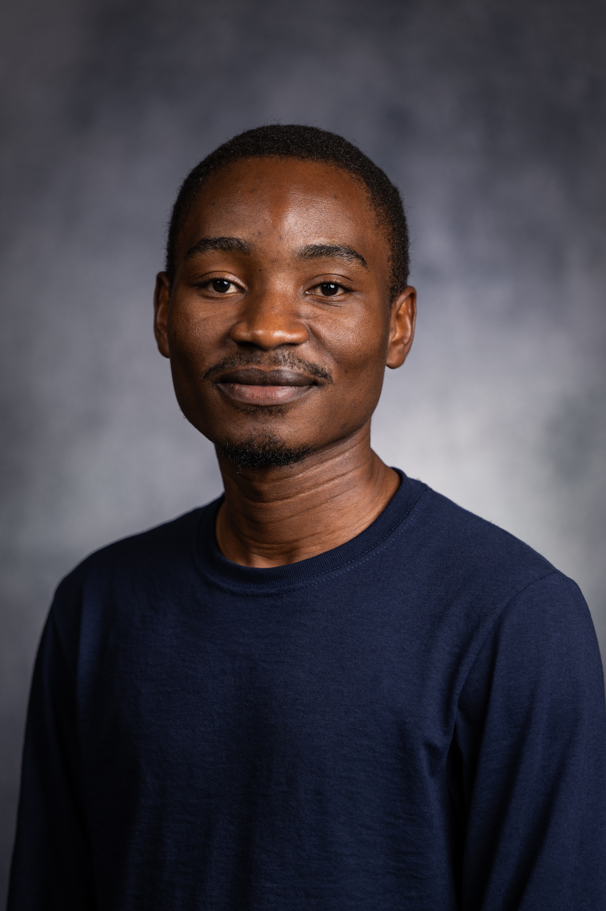

::: {.home-grid}
::: {.home-photo}
{fig-alt="Laston Manja"}

  

  <i class="fa-solid fa-location-dot"></i>
  Ann Arbor, MI

  <a href="mailto:lmanja@umich.edu">
    <i class="fa-solid fa-envelope"></i>
    Email
  </a>

  <a href="https://scholar.google.com/citations?user=sqVwC2oAAAAJ&hl=en" target="_blank" rel="noopener noreferrer">
    <i class="fa-solid fa-graduation-cap"></i>
    Google Scholar
  </a>

  <a href="https://orcid.org/0000-0002-0446-7674" target="_blank" rel="noopener noreferrer">
    <i class="fa-brands fa-orcid"></i>
    ORCID
  </a>

  <a href="https://github.com/laston-manja" target="_blank" rel="noopener noreferrer">
    <i class="fa-brands fa-github"></i>
    GitHub
  </a>

  <a href="https://www.linkedin.com/in/laston-manja-68a44995" target="_blank" rel="noopener noreferrer">
    <i class="fa-brands fa-linkedin"></i>
    LinkedIn
  </a>

  <a href="https://x.com/manjalaston?s=11&t=wQ6eXhSgbIo98x9OBB5l3A" target="_blank" rel="noopener noreferrer">
    <i class="fa-brands fa-x-twitter"></i>
    X / Twitter
  </a>

:::

::: {.home-text}
# Laston Manja

**Ph.D. Candidate in Economics, University of Michigan**  
**Lecturer in Economics, University of Malawi**

I am an Economics Ph.D. candidate at the University of Michigan with interests in development economics and labor economics.

My current research studies how institutions, public policy, and local environments shape human capital, household behavior, and economic outcomes. I use administrative data, geospatial data, surveys, and field experiments, with ongoing projects on colonization, school finance, and urban sanitation in Malawi, Uganda, and other African contexts.

I am from Blantyre, Malawi. I obtained a Bachelor of Social Science and an M.A. in Economics from the University of Malawi, where I currently hold a position as Lecturer in Economics. I previously worked with the World Bank’s Macroeconomics, Trade and Investment and Education Global Practices, and was a 2022 University of Michigan African Presidential Scholars Fellow.
:::
:::

## Research interests

Development economics; labor economics; education; public finance; political economy; African economic development.

## Research in progress

**Colonizer Identity and Economic Development: Evidence from the “Scramble for Africa”**  
with [Thomas Lloyd](https://thomaslloyd.me)  
A project studying how colonial identity shaped long-run economic development in Africa.

**School Finance, Administrative Capacity, and Resilience in Malawi**  
Third-year paper  
A project studying how school financing arrangements affect education outcomes, financial management, and schools’ responses to shocks.

For my mostly descriptive pre-Ph.D. research, please see my [ORCID profile](https://orcid.org/0000-0002-0446-7674).